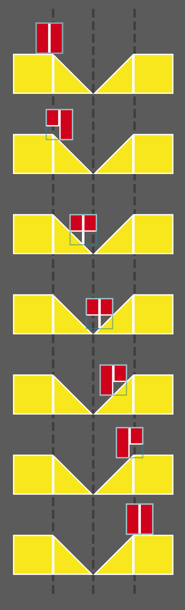

# Platformer

Experements in building a platformer in the style of Super Mario World and/or 3.

## Build with

- Swift 4.2
- Xcode 10
- macOS
- Sprite Kit

## Inspired by

- Working from platformer code from [Super Mario War](https://github.com/mmatyas/supermariowar) by Florian Hufsky, fork by [Mátyás Mustoha](http://mmatyas.github.io/)
- Camera break downs inspired by [Scroll Back: The Theory and Practice of Cameras in Side-Scrollers](http://www.gamasutra.com/blogs/ItayKeren/20150511/243083/Scroll_Back_The_Theory_and_Practice_of_Cameras_in_SideScrollers.php) by [Itay Keren](https://twitter.com/itayke)
- Slopes from (jrndev #2)[https://web.archive.org/web/20100526071550/http://jnrdev.72dpiarmy.com:80/en/jnrdev2/] by Florian Hufsky
- Slopes from (tuts+)[https://gamedevelopment.tutsplus.com/tutorials/basic-2d-platformer-physics-part-7-slopes-groundwork--cms-28472]

## Slope Colisions

Collisions on slopes are done by using two bounding boxes on each half of the player and adjusting them if the player is above a slope.

 
